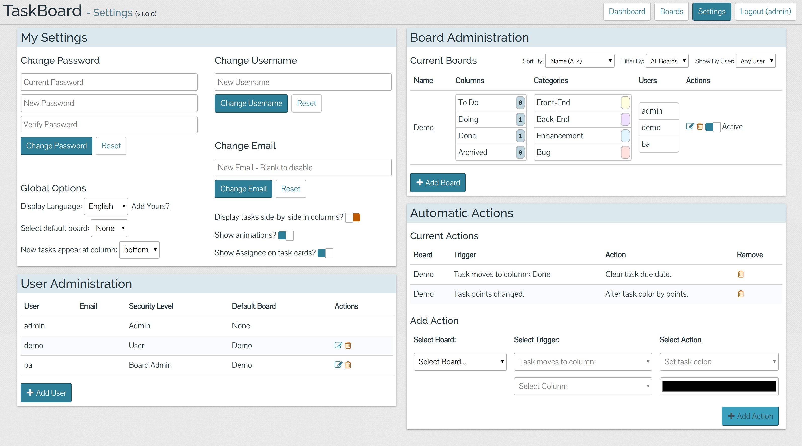
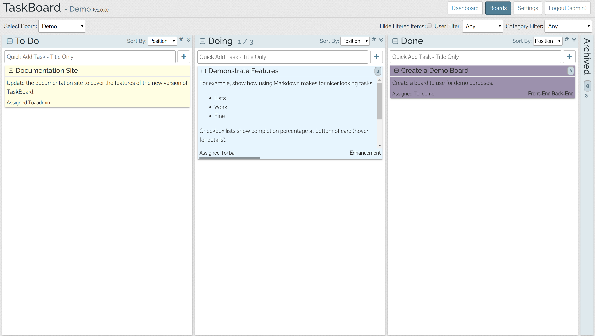
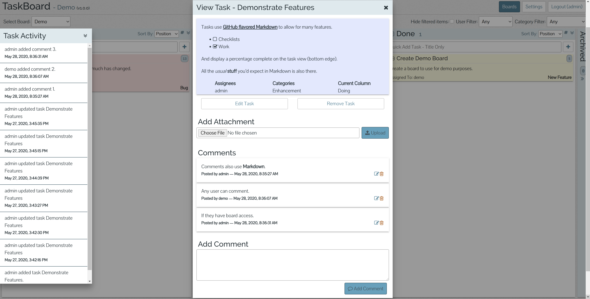

<<<<<<< HEAD
# **N O T I C E**

TaskBoard is currently being re-written from scratch. The `master` and `dev` branches are still maintained, but are not getting new features at this time.

If you'd like to see how it's progressing, take a look at [the `re-write` branch](https://github.com/kiswa/TaskBoard/tree/re-write) (keeping in mind it's still a work in progress at this point) or the [GitHub Project](https://github.com/kiswa/TaskBoard/projects/1?fullscreen=true).

=======
>>>>>>> re-write
# TaskBoard

**N O T I C E - This branch is in active development! Not all items in this README are final or guaranteed to be accurate until it is merged to `master`!**

[](https://travis-ci.org/kiswa/TaskBoard) [](https://www.codacy.com/app/kiswa-com/TaskBoard?utm_source=github.com&amp;utm_medium=referral&amp;utm_content=kiswa/TaskBoard&amp;utm_campaign=Badge_Grade) [](https://gitter.im/kiswa/TaskBoard?utm_source=badge&utm_medium=badge&utm_campaign=pr-badge&utm_content=badge) [](https://reddit.com/r/TaskBoard)

A [Kanban](http://en.wikipedia.org/wiki/Kanban_board)-inspired app for keeping
track of things that need to get done.

<<<<<<< HEAD
### How It's Made
=======
The goal of TaskBoard is to provide a simple and clean interface to a
functional and minimal application for keeping track of tasks.
**It's not trying to be the next Trello or LeanKit.**
>>>>>>> re-write

## Installation

### Prerequisites

A web server running PHP 7.x with sqlite enabled (it may work on PHP 5.6, but
is not supported). See [PHP Supported Versions](https://www.php.net/supported-versions.php).

The server must have `sqlite3` and `php7-sqlite` installed.  
**- OR -**  
If you're comfortable changing code, you can use any database [supported by RedBeanPHP](https://redbeanphp.com/index.php?p=/connection).

### Install

Installing TaskBoard is as easy as 1, 2, 3!

1. Download [the latest release](#) since v1.0.0
2. Extract it to your webserver
3. Verify the `api` directory is writable

If you intend to use email features, you will need to edit `api/helpers/mailer.php`.

<<<<<<< HEAD
## Installation

### Requirements
A web server running PHP with sqlite enabled. Developed and tested under Apache2 running PHP 5.5+.
=======
### Server Config

#### Apache
>>>>>>> re-write

The directory you create for TaskBoard must have `AllowOverride` set so the
`.htaccess` files work.

You also have to have `mod_rewrite` installed and enabled.

#### NGINX

<<<<<<< HEAD
### Install
=======
TODO
>>>>>>> re-write

#### IIS

See the [Wiki Page](https://github.com/kiswa/TaskBoard/wiki/TaskBoard-on-IIS)

### First Use

Open a web browser to the location you installed TaskBoard and use `admin` as
the username and password to log into TaskBoard.

Go to the `Settings` page to update your user (username, email, password,
*etc.*) and create your first board!

## Features

### Users & Settings

There are three types of users, and the settings page is slightly different
for each.

* User - View boards assigned to them and update their own settings and options.
* Board Admin - Same as above, with the ability to manage boards they are
added to.
* Admin - Same as above, with the ability to add/remove users and boards.



### Boards

Each board may have as many columns as needed. For example, a software project
might have columns like:

<<<<<<< HEAD
## Features

### Email
=======
* Proposed
* Backlog
* In Work
* Test
* Done
* Archived

Or maybe you want to track a simple todo list with just:
>>>>>>> re-write

* Todo
* Doing
* Done

It's all up to you! However many columns you have, each column may have tasks
added to it, and tasks can be dragged to other columns as they progress
(or edited and assigned to a new column).

<<<<<<< HEAD
### Settings
The settings page allows normal users to see what boards they have access to and edit their user settings.
=======
Boards may also have categories for additional organization, *e.g.* `Bug`,
`Enhancement`, `New Feature`.
>>>>>>> re-write



### Tasks

<<<<<<< HEAD
### Boards
Each board may have as many columns as needed. For example, a software project might have columns like:
=======
A task only has to have a Title to be added to a board, but there is much more
available. Tasks may be assigned to any user on the board (or left Unassigned),
and include options for Due Date, Color, Points (an optional difficulty
rating), and Category.
>>>>>>> re-write

TaskBoard uses a [Markdown](https://github.com/adam-p/markdown-here/wiki/Markdown-Cheatsheet#table-of-contents)
parser for the Description, allowing for better display of details
(like this readme).

Once a task has been entered, it may have Comments (also supporting Markdown)
or Attachments added to it by viewing the task detail. There is a link to edit
the task, which takes you to a modal much like the original add task dialog.

For admin users, there is also a link to delete the task. This view also shows
the task's activity log on the side of the screen, displaying the complete
history of events related to the task.



## Development

Developing on TaskBoard is pretty simple too.

1. Clone the repository and navigate to it `git clone https://github.com/kiswa/TaskBoard && cd TaskBoard/`
2. Run `git checkout dev` to work on the `dev` branch
3. If you don't have it already, install the Angular CLI globally with `npm i -g @angular/cli`
4. Run `npm i` to install dependencies (this also installs the API dependencies)
5. Run `npm run watch` for the build to automatically run after any change

### Unit Tests

Both the API and App are unit tested. To run all tests, use the command
`npm run test`. For only one set, run `npm run test:api` or `npm run test:app`.

To have the app tests run & update as you work, use the command
`npm run test:watch`.

If you want to run a single API test, add the following comment block before
the test function and use the command `npm run test:api-single`.

``` php
/**
 * @group single
 */
```

If you want to run a single App test, change the test from
`it('should do something', ...);` to `fit('should do something', ...);` and
only that test will run.

<<<<<<< HEAD
### Items
An item (task) only has to have a Title to be added to a board, but there is much more than that available. Items may be assigned to any user on the board (or left Unassigned), and include options for Due Date, Color, Points (an optional difficulty rating), and Category.
=======
These tests are run by [Travis CI](https://travis-ci.org/) on PRs and commits.
A PR with failing or missing tests will not be merged.
>>>>>>> re-write

## Contributing

Fork the repository and make your changes on the `dev` branch.

Create a pull request against the `dev` branch to merge your changes with the
main repository.

<<<<<<< HEAD
## Feedback
=======
Make sure to include/update unit tests.
>>>>>>> re-write

## Feedback

Constructive feedback is appreciated! If you have ideas for improvement, please
[add an issue](https://github.com/kiswa/TaskBoard/issues) or implement it and
submit a pull request.

If you find a bug, please post it on the [Issue Tracker](https://github.com/kiswa/TaskBoard/issues).

<<<<<<< HEAD
## Lines of Code
=======
## How It's Made

### Front End

* [Angular](https://angular.io/) single-page app (not AngularJS)
* [Bourbon](http://bourbon.io/) and [Neat](http://neat.bourbon.io/) SCSS
library & grid
* [scss-base](https://www.npmjs.com/package/scss-base) for the base styling
* [marked](https://github.com/chjj/marked) Markdown parser
* [Chartist.js](https://gionkunz.github.io/chartist-js/) for all charts

### Back End

* [Slim Framework](http://www.slimframework.com/) and
[RedBeanPHP](http://www.redbeanphp.com/) for a RESTful API
* [PHPMailer](https://github.com/PHPMailer/PHPMailer) for sending emails
* [JWT](https://jwt.io/) authentication
* [SQLite](https://www.sqlite.org/) database

## Lines of Code

Because I like seeing the numbers.

### `src`

Language   |   Files |    Blank |  Comment |    Code
-----------|--------:|---------:|---------:|---------:
TypeScript |    66   |    971   |    134   |   4059
PHP        |    20   |    752   |     40   |   2265
HTML       |    21   |    260   |      2   |   1550
SASS       |    14   |    298   |     10   |   1344
**SUM:**   | **121** | **2281** |  **186** | **9218**
>>>>>>> re-write

Command: `cloc --exclude-dir=vendor,favicons --exclude-ext=json,svg,ini src/`

### `test`

Language   |  Files |    Blank |  Comment |    Code
-----------|-------:|---------:|---------:|---------:
TypeScript |   38   |   1009   |      8   |   3526
PHP        |   11   |    795   |     19   |   2301
**SUM:**   | **49** | **1804** |   **27** | **5827**

Command: `cloc --exclude-ext=xml test/`
